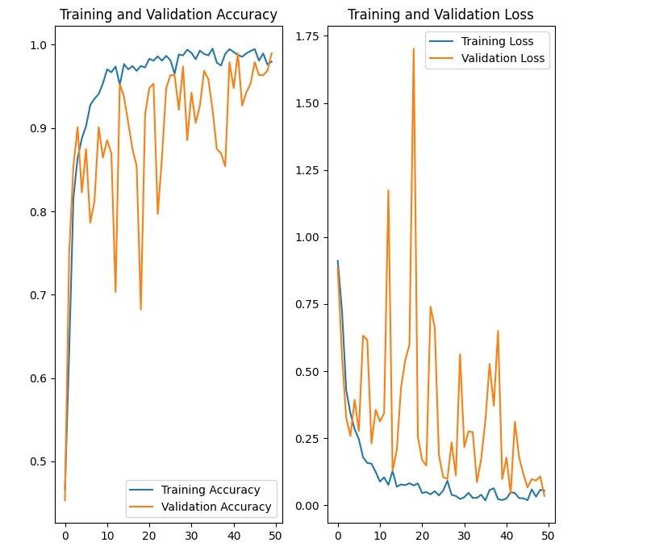
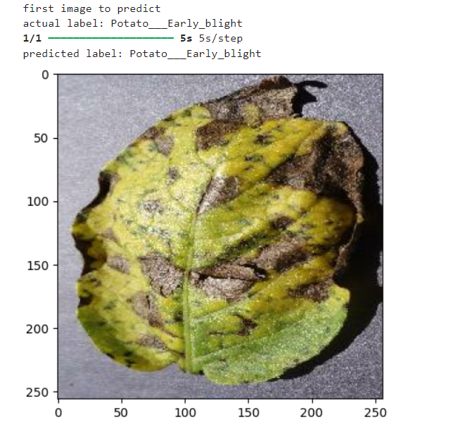
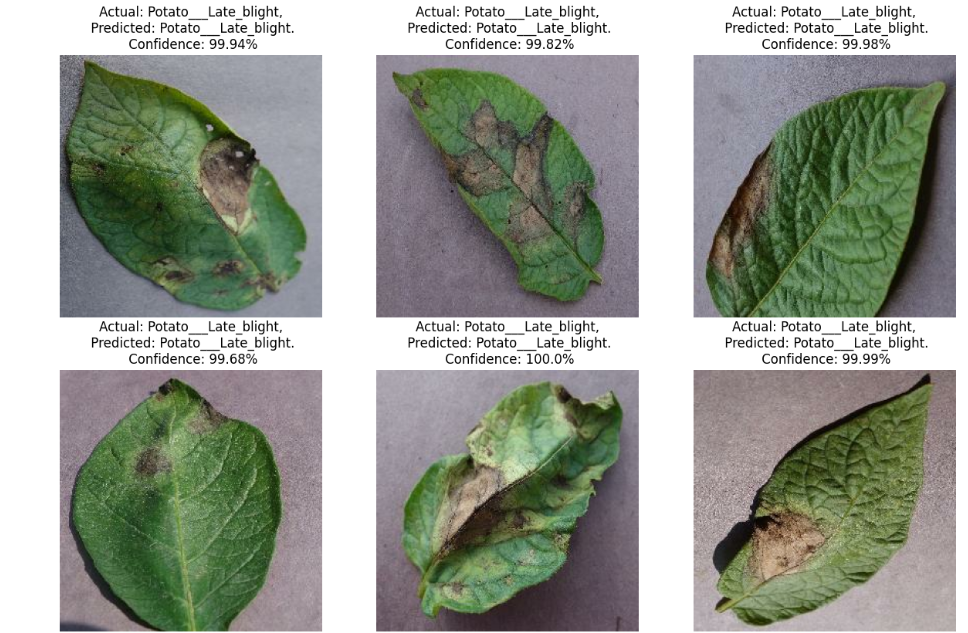

# Potato-Disease-Classification-Using-CNN
End to end deep learning project to classify disease in potato plant as either early blight or late blight.

Early blight and late blight are two common diseases that affect potato crops, caused by different pathogens but often resulting in significant crop damage if not properly managed.

### Early Blight (Alternaria solani)
* Pathogen: Caused by the fungus Alternaria solani.
Symptoms:
* Leaf Spots: Dark brown to black spots with concentric rings (often resembling a "target" pattern).
* Yellowing: Leaves may yellow and die prematurely, starting from the oldest leaves.
* Stem Lesions: Dark, sunken lesions may appear on stems and petioles.
* Tuber Symptoms: In severe cases, tubers can develop dark, sunken lesions that are dry and corky.
* Conditions Favoring Disease: Warm temperatures (24–29°C or 75–85°F) and high humidity, particularly with alternating wet and dry periods.

### Late Blight (Phytophthora infestans)
* Pathogen: Caused by the oomycete Phytophthora infestans, which was historically responsible for the Irish Potato Famine.
Symptoms:
* Leaf Lesions: Water-soaked, pale green to dark brown or black lesions that often have a pale green halo. These lesions can spread rapidly, causing leaf death.
* White Mold: A white, downy mold may appear on the underside of infected leaves in humid conditions.
* Stem Blight: Stems may show dark brown to black lesions, leading to collapse.
* Tuber Symptoms: Tubers develop irregular, sunken lesions that are firm and brown to purplish on the surface, with brown, granular decay inside.
* Conditions Favoring Disease: Cool (10–20°C or 50–68°F), wet, and humid conditions, especially with prolonged leaf wetness.

### Model Building
* Tensorflow
* CNN
* Data Augmentation
* tf database

### Backend Server
* tf server
* FastAPI

### Model Optimization
* Quantization
* Tensorflow Lite

### Frontend and Deployment
* React
* React Native
* Deployment to GCP

### Data Collection

Dataset is taken from Kaggle: https://www.kaggle.com/arjuntejaswi/p...

## Convolutional Neural Network (CNN)

A Convolutional Neural Network (CNN) is a class of deep neural networks commonly used in computer vision tasks such as image classification, object detection, and segmentation. CNNs are designed to automatically and adaptively learn spatial hierarchies of features from input images, making them highly effective for image data.

Key Components of a CNN
### Convolutional Layers:

Purpose: Extract features from the input image by applying a set of learnable filters (kernels). Each filter produces a feature map that captures specific patterns (e.g., edges, textures) in the input.
Operation: A convolution operation involves sliding a filter over the input image and computing the dot product between the filter and the image regions.
Output: The result is a feature map that highlights the presence of the learned features.

### Activation Function (ReLU):
Purpose: Introduce non-linearity into the model, allowing it to learn complex patterns. The most common activation function is the Rectified Linear Unit (ReLU), which applies a simple threshold operation on each element.
Operation: 

ReLU(x)=max(0,x)
Output: The ReLU activation function helps to retain the positive values in the feature maps while setting negative values to zero.

### Pooling Layers:
Purpose: Reduce the spatial dimensions (width and height) of the feature maps while retaining the most important features, thus reducing the computational load and helping the network to become more invariant to small transformations.
Types:
Max Pooling: Takes the maximum value in a window.
Average Pooling: Takes the average of values in a window.
Operation: Typically applied with a 2x2 window and a stride of 2, effectively halving the size of the feature map.

### Fully Connected Layers:
Purpose: Combine the features learned by convolutional and pooling layers to make final predictions.
Operation: These layers are similar to those in traditional neural networks, where each neuron is connected to every neuron in the previous layer.
Output: The output of the final fully connected layer typically has the same dimension as the number of classes for classification tasks, with a softmax activation applied to produce probabilities.

### Softmax Layer (for classification):
Purpose: Converts the logits from the final fully connected layer into probabilities for each class.
The Softmax layer is commonly used in the final layer of a neural network for multi-class classification tasks. It converts the raw output (logits) of the network into a probability distribution across different classes, allowing the model to output a probability for each class that sums to 1.

## Adam Optimizer
The Adam optimizer is a popular choice in machine learning, particularly for deep learning models, because it combines the advantages of both the AdaGrad and RMSProp algorithms. Adam stands for Adaptive Moment Estimation, and it computes adaptive learning rates for each parameter by estimating first and second moments of the gradients.

Key Features of Adam:
Adaptive Learning Rate: Adam adjusts the learning rate individually for each parameter, which helps in converging faster and avoiding issues like vanishing gradients.
Momentum: Adam uses momentum to accelerate gradient descent, which helps in smoothing the optimization process.
Bias Correction: It includes mechanisms to correct biases in the estimates of the first and second moments, especially in the early stages of training.

### Plots

